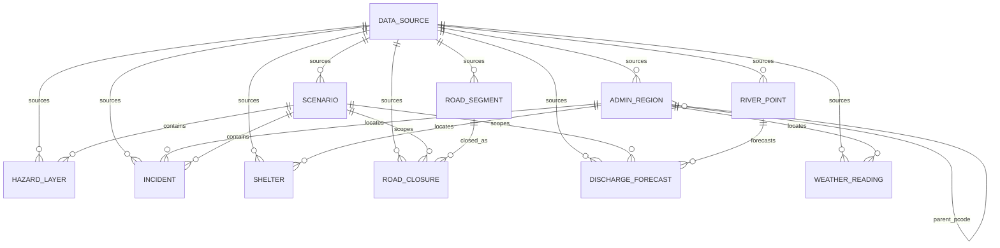

# Praxis — Architecture

This document explains how Praxis is structured, why each technology was chosen,
and which external data sources will feed the platform in later phases. It is the
reference for reviewers and future contributors.

## 1. The operating model: Sense → Decide → Act → Learn

Praxis is deliberately organised as a **doctrine loop** rather than a set of
disconnected screens. Emergency management is cyclical: authorities build a
picture, choose a course of action, execute it, and learn from the result — then
do it again as the situation evolves. The product mirrors that cycle exactly.

| Stage      | Question it answers                     | What lives here (from Phase 2 on)                                                            |
| ---------- | --------------------------------------- | ------------------------------------------------------------------------------------------- |
| **Sense**  | *What is happening right now?*           | Live dashboard: incidents, shelters, assets, road closures, and a MapLibre situational map. |
| **Decide** | *What should we do about it?*            | **Playbook Studio** (flagship): compose response strategies, compare them, stress-test under uncertainty. |
| **Act**    | *How do we execute the chosen plan?*     | Export a ready-to-execute operational brief (tasks, assignments, timing).                   |
| **Learn**  | *Did it work, and what do we change?*    | After-action comparison of the chosen plan vs. the actual outcome; feeds doctrine back into Sense. |

**Design consequence.** The frontend's primary navigation *is* the loop
(`/sense`, `/decide`, `/act`, `/learn`), with an overview landing at `/`. The
sidebar renders the four stages as an ordered, visually connected sequence so the
cycle is legible at a glance. This model is encoded once in
`frontend/src/config/nav.ts` and shared by the sidebar, routes, and landing page.

## 2. System shape

```
┌──────────────────────────┐        HTTP/JSON        ┌──────────────────────────┐
│        Frontend          │  ───────────────────▶   │         Backend          │
│  React + Vite (SPA)      │                         │  FastAPI (async)         │
│  TanStack Query · Zustand│  ◀───────────────────   │  Pydantic v2 · structlog │
│  Tailwind + shadcn/ui    │        /health          │  request-id middleware   │
│  MapLibre GL (Phase 3)   │        /api/v1/*        │                          │
└──────────────────────────┘                         └────────────┬─────────────┘
                                                                   │ SQLAlchemy 2.0 (async)
                                                                   │ + GeoAlchemy2
                                                                   ▼
                                                     ┌──────────────────────────┐
                                                     │   PostgreSQL 16 + PostGIS │
                                                     │   (Docker Compose)        │
                                                     └──────────────────────────┘
```

- The **frontend** is a single-page app. Server state (health, scenarios) is
  owned by **TanStack Query**; ephemeral UI state (theme, sidebar, selected
  scenario) by **Zustand**. This separation keeps caching/refetching concerns out
  of component-local state.
- The **backend** is an async FastAPI app. `/health` performs a real database
  probe; `/api/v1/*` is the versioned domain surface (scenarios + GeoJSON
  layers). A request-id middleware binds a correlation id onto every structured
  log line.
- **PostGIS** is the spatial backbone. Phase 2 adds the domain model (geometry
  columns, GIST indexes) and the ingestion CLI. MapLibre rendering of those
  layers is Phase 3.

## 3. Stack decisions — and why

### Frontend

- **React 18 + TypeScript (strict).** Strict mode (`noImplicitAny`,
  `noUncheckedIndexedAccess`, `exactOptionalPropertyTypes`, …) catches whole
  classes of defects before runtime — appropriate for a public-safety tool.
- **Vite.** Near-instant dev server and fast, modern production builds; the
  default for new React apps.
- **Tailwind CSS + shadcn/ui (Radix).** Tailwind gives a constrained, token-driven
  styling system; shadcn/Radix supply accessible, unstyled primitives we own and
  restyle. Components live *in the repo* (not a black-box library), so the design
  system is fully under our control. The tokens are defined once in
  `src/styles/globals.css` and bridged through `tailwind.config.ts`.
- **MapLibre GL JS.** Open-source, no API token, works with free vector basemaps
  (e.g. OpenFreeMap) — important for a public-sector tool with no vendor lock-in.
  Wired into Sense in Phase 2.
- **TanStack Query + Zustand.** Best-in-class server-state caching and a tiny,
  ergonomic client-state store, respectively.
- **Framer Motion / lucide-react.** Restrained motion for a calm feel and a
  consistent icon set (both used from Phase 1). **Recharts** (charts for
  Decide/Learn) and **MapLibre GL** (the Sense map) are part of the stack but are
  introduced when their stages gain data in Phase 3 — they are intentionally not
  pulled in as unused dependencies now.
- **i18next.** Localisation scaffolding is in place with English wired now;
  Sinhala (`si`) and Tamil (`ta`) — Sri Lanka's other official languages — slot in
  during Phase 8 with no structural change.
- **Vitest + Testing Library.** Fast, Vite-native testing.
- **Biome.** A single fast tool for both lint and format, replacing the
  ESLint + Prettier pair to reduce config surface and CI time.

### Backend

- **Python 3.12 + FastAPI + Pydantic v2.** Async-first, type-driven APIs with
  automatic OpenAPI docs. Pydantic v2 gives fast validation and clean schema
  definitions shared with the frontend's TypeScript types.
- **SQLAlchemy 2.0 (async) + GeoAlchemy2.** The 2.0 typed ORM with async engines
  (via `asyncpg`); GeoAlchemy2 adds PostGIS geometry types for the spatial domain.
- **Alembic (async).** Schema migrations run against the same async engine and
  metadata the app uses, so there is one source of truth. Migration 0001 enables
  PostGIS; 0002 creates the domain tables, geometry columns, and GIST indexes.
- **pydantic-settings.** Environment-driven config with typed defaults; a fresh
  clone boots without manual setup.
- **structlog.** Structured (JSON in production) logs with a per-request id for
  correlation.
- **uv.** Fast, reproducible Python dependency management and virtual envs.
- **Ruff.** A single fast tool for lint + format on the Python side (mirrors
  Biome's role on the frontend).

### Data / infra

- **PostgreSQL 16 + PostGIS 3.4 via Docker Compose.** A reproducible local spatial
  database with a persisted named volume. The host port defaults to **5433** to
  avoid clashing with a stock local Postgres.

## 4. Configuration & security posture

- All configuration is environment-driven (`.env`, documented in `.env.example`).
  The real `.env` is git-ignored; only defaults safe for local development are
  committed.
- CORS is restricted to the configured frontend origin(s).
- Accessibility and contrast are treated as first-class: the theme targets WCAG AA
  because operators use this under stress, often on imperfect displays.

## 5. Public data sources (Phase 2)

Praxis ingests authoritative, mostly-open data behind a normalised internal
model. **Every layer has a `data_source` row**; synthetic placeholders are
flagged `is_synthetic = true` and are never presented as authentic.

The live ledger is `just data-report`. The human-readable catalogue — URLs,
licences, the 2017 vs 2024 seed-event decision, and NBRO/DMC access caveats —
is [`docs/DATA_SOURCES.md`](DATA_SOURCES.md).

## 6. Domain data model

All geometries are EPSG:4326. Every geometry column has a GIST index. Enums are
stored as checked VARCHAR values (`flood`, `historical`, `flood_extent`, …)
rather than native PostgreSQL enum types, so SQLite unit tests and migrations
stay simple.



- `admin_region` — COD-AB hierarchy (0 country → 4 GN), unique `pcode`.
- `scenario` — one real historical event in the demo (`2017-sw-monsoon-kalu-ganga`).
- `hazard_layer` — flood extent (scenario-scoped) or landslide zonation (standalone).
- `shelter` — OSM **candidate** facilities, not an official registry.
- `road_closure` — scenario-scoped; demo rows are inferred and flagged synthetic.
- `discharge_forecast` — GloFAS ensemble stats in m³/s (Phase 5 uncertainty backbone).

## 7. ETL engine split

The API keeps the **async** SQLAlchemy engine (`postgresql+asyncpg://…`) so
request handlers stay non-blocking.

Ingestion (`uv run python -m app.cli …`) uses a **separate sync** engine
(`postgresql+psycopg://…`, see `app/db/sync_session.py` and
`Settings.sync_database_url`). GeoPandas `to_postgis`, shapefile IO, and bulk
deletes/inserts are simpler and faster on a blocking connection, and the CLI
runs outside the API event loop. Both engines are derived from the single
`PRAXIS_DATABASE_URL` — there is still one source of truth for credentials.

Pipelines are idempotent: each layer is owned by its `data_source`; a reload
deletes that source's rows and re-inserts. Raw files cache under
`backend/data/raw/` (git-ignored).

## 8. Sense dashboard — frontend data flow (Phase 3)

The `/sense` dashboard (`src/features/sense/`) renders the Phase 2 GeoJSON APIs
as an operational map.

```
useUiStore.selectedScenarioSlug
        │
        ▼
TanStack Query hooks (one per layer, keyed by slug)   ── src/features/sense/hooks.ts
  useScenarioDetail · useAdminRegions(level) · useHazardLayers
  useShelters · useIncidents · useRoads · useRivers · useDischarge
        │  (GeoJSON FeatureCollections, cached; toggling never refetches)
        ▼
SenseDashboard  ── assembles MapData, computes KPIs (pure, kpis.ts)
        │
        ├── KpiStrip        (scenario vitals; sample figures flagged)
        ├── LayerPanel      (legend + toggles + provenance; useSenseStore)
        ├── MapCanvas       (imperative MapLibre; see below)
        └── ContextPanel    (selected feature; DischargeChart for rivers)
```

**Map integration.** `MapCanvas` wraps `maplibre-gl` directly through a small
set of effects rather than a React binding library. Sources and layers are added
**imperatively** (`addSource`/`addLayer`), and data arrives via `source.setData`
— so the 5.4k-feature road layer and 3.3k-feature incident layer are single GL
layers, never thousands of React/DOM nodes. Effects are split by concern
(create-once; re-add layers on style (re)load via an `epoch` counter; `setData`
on data change; visibility on toggle; selection halo; fit-bounds) so a layer
toggle only flips `visibility` and never re-parses GeoJSON.

**Basemap + theme.** Free CARTO vector styles (`dark-matter` / `positron`, no
token). The map is remounted via a React `key={theme}` on theme change, which
guarantees the basemap matches the theme without a fragile `setStyle` race. Map
paint colors are read from the design-system CSS custom properties at runtime
(`mapColors.ts`) so the map matches the token palette.

**Selection.** A single map click handler queries the clickable layers in
priority order (river → incident → shelter → admin) so a point feature always
wins over the admin polygon beneath it; the choice updates `useSenseStore` and a
selection halo source.

**Honesty.** `is_synthetic` from each feature/source drives dashed/translucent
paint, "sample" legend tags, and provenance lines — real and sample data are
never visually interchangeable.

**Performance notes / Phase 8.** Stage routes are lazy-loaded, so MapLibre
(~800 kB) and Recharts (~410 kB) sit in their own chunks loaded only on `/sense`.
The dissolved flood-extent payload is ~0.9 MB; admin/roads are server-simplified.
For Phase 8, consider serving the largest layers as vector tiles (or further
`ST_SimplifyPreserveTopology` by zoom) and viewport-bounded incident queries.

## 9. Playbook Studio & scoring (Phase 4)

A **playbook** (`migration 0003`, `models/playbook.py`) is a scenario-scoped
response strategy: a name plus a versioned JSONB `levers` payload (priority
regions, activated shelters, evacuation threshold, resource posture, access
policy) and a cached JSONB `score_result`.

**Scoring is layered for testability and the Phase 5 seam:**

```
levers + scenario
      │
      ▼
gather_scoring_inputs()  ── PostGIS: areal-weighted at-risk population,
  (services/scoring/gather.py)  shelter capacity + reachability vs. closures
      │  → ScoringInputs (plain, serializable)          [region facts memoised]
      ▼
score(inputs)  ── pure, deterministic, framework-free   (services/scoring/core.py)
      │  → ScoreResult (sub-metrics + raw numbers + real/synthetic/assumption)
      ▼
API: POST …/playbooks(/preview-score|/{id}/score)   ·   GET …/playbook-defaults
```

- The **core** (`score`) never touches the DB — it takes plain `ScoringInputs`
  and returns a `ScoreResult`. Unit-tested for exact numbers and flag
  propagation. **Phase 5** perturbs `ScoringInputs` over a distribution and calls
  the same core (Monte-Carlo) — no core rewrite.
- The **input resolver** (`gather`) does the spatial work. Per-scenario region
  facts are heavy but lever-independent, so they are **memoised** and warmed at
  startup; live preview scoring is then sub-100 ms.
- Every metric formula and its provenance/assumption flags are documented in
  [`SCORING.md`](SCORING.md). Endpoints: CRUD under
  `/api/v1/scenarios/{slug}/playbooks`, plus `preview-score` (score without
  saving), `playbook-defaults`, `playbook-context`, and `shelters-in-regions`.

**Frontend** (`features/decide/`): a two-mode studio (Builder / Compare) with a
playbook list rail; TanStack Query per resource, a debounced live-preview query,
Zustand for draft levers + comparison selection; a compact MapLibre context map;
and a Recharts comparison chart. All copy via i18next; synthetic/assumption flags
rendered on every metric.

## 10. Stress-test engine — uncertainty under Monte Carlo (Phase 5)

The stress-test engine reuses the Phase-4 `score()` core **unchanged** as its inner
function. It draws N perturbed input samples from documented distributions, scores
each, and aggregates into confidence bands plus a downside-focused robustness
measure. It is pure and deterministic given a seed (no DB/HTTP inside the engine),
so aggregates are unit-testable and `same playbook + config + seed → identical
result`.

```
StressTestRequest (config?, n_iterations, seed?)
      │
      ▼
gather_scoring_inputs()  ── one PostGIS resolve (async, memoised region facts)
      │  → ScoringInputs (base, point estimate)
      ▼
run_stress_test(base, config, n_iterations, seed)   (services/scoring/stress.py)
      │   random.Random(seed)
      │   for each iteration:
      │     sample_inputs(base, config, rng)  ── perturb inputs   (uncertainty.py)
      │       └─▶ score(perturbed)            ── UNCHANGED pure core
      │   aggregate → mean/median/std/p05..p95, 20-bin histogram, robustness
      ▼
StressResult  (summaries + histogram + robustness + config + epistemic flags)
      ▼
persist stress_run (config, n_iterations, seed, aggregated result — NOT raw samples)
      ▼
API: POST …/playbooks/{id}/stress-test  ·  GET …/stress-runs(/{id})  ·  GET …/uncertainty-defaults
```

**Execution model.** Monte Carlo is CPU-bound but fast (N=1000 ≈ 55 ms pure). The
`POST …/stress-test` endpoint resolves inputs asynchronously, then runs the engine
off the event loop via `anyio.to_thread.run_sync` so the API stays responsive, and
persists the aggregated result before returning. This synchronous-with-threadpool
approach is the simplest robust design at this scale; the persisted-run model
(`stress_run` table, `migration 0004`) is also the **seam for a background-job
worker** if iteration counts or scenarios grow — the client already reads results
by run, so moving to a poll-for-completion flow needs no schema change.

**Honesty & the forecast seam.** The seed event is historical, so the engine models
**epistemic** (parameter) uncertainty, not forecast/observed spread; every result
carries `uses_synthetic_data` and an `epistemic_note`, and the UI leads with an
epistemic banner. Swapping the single `sample_inputs` call for a GloFAS-ensemble
provider would yield real aleatoric forecast members through the identical
aggregation — an intentional, documented seam, not implemented here.

**Frontend** (`features/decide/stress/`, `compare/CompareUncertainty.tsx`): the
Builder gains a Live/Stress toggle; the stress panel renders the explained editable
config (class badges, distributions, bases, toggles, iteration count) and a results
view (histogram, band, plain-language robustness, epistemic label). Compare mode
upgrades to compare **under uncertainty** (bands + robustness) and highlights the
robust-winner-≠-point-winner reversal.

Full parameter model, bases, and the robustness definition:
[`UNCERTAINTY.md`](UNCERTAINTY.md).

## 11. Operational brief pipeline — the Act stage (Phase 6)

The Act stage narrates the computed results into an exportable operational brief.
Its defining constraint: **the LLM structures and narrates real data; it never
invents a number.** That guarantee is structural, not aspirational — a typed trust
boundary plus a post-generation numeric guard.

```
playbook + scenario + (optional) stress run
      │  gather_scoring_inputs() · score() · StressResult
      ▼
build_brief_facts(...) ──► BriefFacts            [trust boundary: the only "facts"]
      │                                            (facts.py — pure, typed)
      ├───────────────────────────► render_template_brief(facts)   [no-LLM path]
      ▼
prompt (facts + strict rules) ─► LLM one bounded call ─► JSON sections   (llm.py, prompt.py)
      ▼
verify_brief(facts, sections) ─► GuardReport      (guard.py)
      │   number in prose ∉ facts pool → section repaired from template
      ▼
BriefContent (guard-clean) ─► persist brief ─► render HTML / PDF   (render.py, migration 0005)
      ▼
API: POST …/playbooks/{id}/brief · GET …/briefs(/{id}) · GET …/briefs/{id}/export.{html,pdf}
```

**Trust boundary.** `BriefFacts` (facts.py) holds only real computed facts —
scenario, levers-in-plain-terms, the scorecard (per-metric score/weight/provenance),
the stress summary, coverage gaps, assumptions and synthetic influences. The
generator receives nothing else.

**Numeric guard.** `verify_brief` builds a pool of every number appearing in the
facts payload (numeric fields + numbers inside strings such as dates/notes, plus
percentile/scale anchors) and checks each number in each generated section against
it (formatting- and rounding-tolerant). Any section with an unverifiable number is
replaced by its deterministic template version; outcomes are logged and persisted.
No unverified figure is emitted.

**No-key fallback.** With `PRAXIS_LLM_ENABLED` false or no key, `generate_brief`
returns the deterministic template — the same function the guard uses for repair.
The full test suite runs with no key (a fake completion is injected; no real API is
ever called).

**LLM client & PDF.** A thin async httpx wrapper on the Anthropic Messages API
(no heavy SDK; base URL configurable), one bounded call under a tenacity retry +
timeout. Export is one Jinja2 template rendered to print-ready HTML and to PDF via
xhtml2pdf (pure-Python, no native libraries — works in CI and locally). Each brief
persists a **facts snapshot** (migration `0005`, `brief` table) so it stays
reproducible and auditable even if the underlying data later changes.

**Frontend** (`features/act/`): the `/act` workspace picks a playbook (+ optional
stress run), generates the brief, renders it as an authoritative document with
provenance badges, the synthetic-data caution, the epistemic framing, a
"verified template" marker on any guard-repaired section, and HTML/PDF export.

Full trust model and judge-defense: [`BRIEF.md`](BRIEF.md).

## 12. After-action pipeline — the Learn stage (Phase 7)

Learn closes the Sense → Decide → Act → Learn loop by comparing a strategy's
**predicted** at-risk ranking against the **actual recorded impact** of the real
historical event. Its defining constraint is honest framing: **predicted vs.
recorded**, where the recorded side is the DesInventar historical baseline, never
the outcome of executing a playbook.

```
playbook + scenario
      │  gather_scoring_inputs()                    recorded_outcomes()  (real incidents,
      │    → predicted at-risk per district           parsed per district, event-year filtered)
      ▼                                                     │
build_after_action(predictions, outcomes)  ◄────────────────┘   (analysis.py — pure)
      │   composite impact (normalised, weighted) · predicted vs recorded ranks
      │   Spearman alignment + top-k overlap · under-prioritised · blind spots
      ▼
AfterActionResult ──► generate_lessons()   (template lessons always; assessment
      │                 optionally LLM-narrated under the Phase-6 numeric guard)
      ▼
persist after_action (migration 0006: result + lessons snapshot)
      ▼
API: GET …/recorded-outcomes · POST …/playbooks/{id}/after-action · GET …/after-actions(/{id})
```

**Recorded outcomes are real.** Deaths / people affected / houses destroyed are
aggregated from DesInventar `incident` rows (parsed from the fixed-format
description) filtered to the scenario's event year; `is_synthetic = false`.
Districts with no records report `has_data = false` ("no recorded data") — never a
fabricated value.

**Composite & alignment.** Each recorded component is min-max normalised across the
district set, then weighted (deaths 0.5 / houses 0.3 / affected 0.2; raw components
always shown). Predicted at-risk rank vs. recorded impact rank are compared by a
tie-safe **Spearman** correlation (pure-Python) plus top-3 overlap, bucketed to
plain language. On the seed 2017 data the rankings are **inverted** (ρ ≈ −0.5) — a
real loop-closing lesson (Colombo predicted #1 recorded 0 deaths; Ratnapura
predicted last recorded the most). Full metric definitions:
[`AFTER_ACTION.md`](AFTER_ACTION.md).

**Trust reuse.** The narrated assessment reuses the Phase-6 guard verbatim (a
shared `pool_from_payload` / `offending_numbers` in `brief/guard.py`): real facts
in, numbers validated against the analysis, template fallback, keyless-safe.

**Frontend** (`features/learn/`): the `/learn` workspace picks a playbook, runs the
review, and renders a recorded-impact choropleth (reusing the map pattern), a
predicted-vs-recorded rank scatter (Recharts), the recorded-impact table with
honesty flags, blind spots, and structured lessons — all under the
predicted-vs-recorded framing.

**Live-outcomes seam.** The analysis core takes plain `DistrictOutcome` records, so
a future live event can swap the DesInventar gather for a live-response provider
with no core change — intentional, not implemented.

## 13. Phase roadmap (abridged)

- **Phase 1.** Foundation: shell, design system, API skeleton, DB + PostGIS
  extension, local dev environment.
- **Phase 2.** Domain models + spatial schema; repeatable ingestion of real
  public data; one seeded historical event; GeoJSON read APIs; scenario selector.
- **Phase 3.** Sense dashboard: MapLibre map, seven toggleable layers, KPI strip,
  feature detail with the GloFAS ensemble chart, real-vs-sample provenance.
- **Phase 4.** Playbook Studio: lever-based strategy builder, deterministic
  transparent scoring on real data, and side-by-side comparison.
- **Phase 5.** Stress-test engine: seeded Monte Carlo over documented parameter
  distributions, confidence bands + robustness, compare-under-uncertainty with
  reversal detection; honest epistemic framing + GloFAS-ensemble seam.
- **Phase 6.** Act: AI-*structured* operational brief over a typed facts boundary
  with a numeric-consistency guard (no fabricated figures), a deterministic no-key
  fallback, and print-ready HTML/PDF export.
- **Phase 7 (this work).** Learn: predicted-vs-recorded after-action review against
  real DesInventar impact — composite impact, Spearman alignment, blind spots, and
  guarded lessons; closes the Sense → Decide → Act → Learn loop.
- **Later.** Sinhala/Tamil, offline, and deployment (Phase 8).
