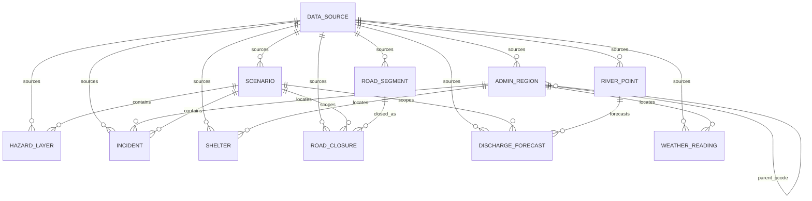

# Praxis — Architecture

This document explains how Praxis is structured, why each technology was chosen,
and which external data sources will feed the platform in later phases. It is the
reference for reviewers and future contributors.

## 1. The operating model: Sense → Decide → Act → Learn

Praxis is deliberately organised as a **doctrine loop** rather than a set of
disconnected screens. Emergency management is cyclical: authorities build a
picture, choose a course of action, execute it, and learn from the result — then
do it again as the situation evolves. The product mirrors that cycle exactly.

| Stage      | Question it answers                     | What lives here (from Phase 2 on)                                                            |
| ---------- | --------------------------------------- | ------------------------------------------------------------------------------------------- |
| **Sense**  | *What is happening right now?*           | Live dashboard: incidents, shelters, assets, road closures, and a MapLibre situational map. |
| **Decide** | *What should we do about it?*            | **Playbook Studio** (flagship): compose response strategies, compare them, stress-test under uncertainty. |
| **Act**    | *How do we execute the chosen plan?*     | Export a ready-to-execute operational brief (tasks, assignments, timing).                   |
| **Learn**  | *Did it work, and what do we change?*    | After-action comparison of the chosen plan vs. the actual outcome; feeds doctrine back into Sense. |

**Design consequence.** The frontend's primary navigation *is* the loop
(`/sense`, `/decide`, `/act`, `/learn`), with an overview landing at `/`. The
sidebar renders the four stages as an ordered, visually connected sequence so the
cycle is legible at a glance. This model is encoded once in
`frontend/src/config/nav.ts` and shared by the sidebar, routes, and landing page.

## 2. System shape

```
┌──────────────────────────┐        HTTP/JSON        ┌──────────────────────────┐
│        Frontend          │  ───────────────────▶   │         Backend          │
│  React + Vite (SPA)      │                         │  FastAPI (async)         │
│  TanStack Query · Zustand│  ◀───────────────────   │  Pydantic v2 · structlog │
│  Tailwind + shadcn/ui    │        /health          │  request-id middleware   │
│  MapLibre GL (Phase 3)   │        /api/v1/*        │                          │
└──────────────────────────┘                         └────────────┬─────────────┘
                                                                   │ SQLAlchemy 2.0 (async)
                                                                   │ + GeoAlchemy2
                                                                   ▼
                                                     ┌──────────────────────────┐
                                                     │   PostgreSQL 16 + PostGIS │
                                                     │   (Docker Compose)        │
                                                     └──────────────────────────┘
```

- The **frontend** is a single-page app. Server state (health, scenarios) is
  owned by **TanStack Query**; ephemeral UI state (theme, sidebar, selected
  scenario) by **Zustand**. This separation keeps caching/refetching concerns out
  of component-local state.
- The **backend** is an async FastAPI app. `/health` performs a real database
  probe; `/api/v1/*` is the versioned domain surface (scenarios + GeoJSON
  layers). A request-id middleware binds a correlation id onto every structured
  log line.
- **PostGIS** is the spatial backbone. Phase 2 adds the domain model (geometry
  columns, GIST indexes) and the ingestion CLI. MapLibre rendering of those
  layers is Phase 3.

## 3. Stack decisions — and why

### Frontend

- **React 18 + TypeScript (strict).** Strict mode (`noImplicitAny`,
  `noUncheckedIndexedAccess`, `exactOptionalPropertyTypes`, …) catches whole
  classes of defects before runtime — appropriate for a public-safety tool.
- **Vite.** Near-instant dev server and fast, modern production builds; the
  default for new React apps.
- **Tailwind CSS + shadcn/ui (Radix).** Tailwind gives a constrained, token-driven
  styling system; shadcn/Radix supply accessible, unstyled primitives we own and
  restyle. Components live *in the repo* (not a black-box library), so the design
  system is fully under our control. The tokens are defined once in
  `src/styles/globals.css` and bridged through `tailwind.config.ts`.
- **MapLibre GL JS.** Open-source, no API token, works with free vector basemaps
  (e.g. OpenFreeMap) — important for a public-sector tool with no vendor lock-in.
  Wired into Sense in Phase 2.
- **TanStack Query + Zustand.** Best-in-class server-state caching and a tiny,
  ergonomic client-state store, respectively.
- **Framer Motion / lucide-react.** Restrained motion for a calm feel and a
  consistent icon set (both used from Phase 1). **Recharts** (charts for
  Decide/Learn) and **MapLibre GL** (the Sense map) are part of the stack but are
  introduced when their stages gain data in Phase 3 — they are intentionally not
  pulled in as unused dependencies now.
- **i18next.** Localisation scaffolding is in place with English wired now;
  Sinhala (`si`) and Tamil (`ta`) — Sri Lanka's other official languages — slot in
  during Phase 8 with no structural change.
- **Vitest + Testing Library.** Fast, Vite-native testing.
- **Biome.** A single fast tool for both lint and format, replacing the
  ESLint + Prettier pair to reduce config surface and CI time.

### Backend

- **Python 3.12 + FastAPI + Pydantic v2.** Async-first, type-driven APIs with
  automatic OpenAPI docs. Pydantic v2 gives fast validation and clean schema
  definitions shared with the frontend's TypeScript types.
- **SQLAlchemy 2.0 (async) + GeoAlchemy2.** The 2.0 typed ORM with async engines
  (via `asyncpg`); GeoAlchemy2 adds PostGIS geometry types for the spatial domain.
- **Alembic (async).** Schema migrations run against the same async engine and
  metadata the app uses, so there is one source of truth. Migration 0001 enables
  PostGIS; 0002 creates the domain tables, geometry columns, and GIST indexes.
- **pydantic-settings.** Environment-driven config with typed defaults; a fresh
  clone boots without manual setup.
- **structlog.** Structured (JSON in production) logs with a per-request id for
  correlation.
- **uv.** Fast, reproducible Python dependency management and virtual envs.
- **Ruff.** A single fast tool for lint + format on the Python side (mirrors
  Biome's role on the frontend).

### Data / infra

- **PostgreSQL 16 + PostGIS 3.4 via Docker Compose.** A reproducible local spatial
  database with a persisted named volume. The host port defaults to **5433** to
  avoid clashing with a stock local Postgres.

## 4. Configuration & security posture

- All configuration is environment-driven (`.env`, documented in `.env.example`).
  The real `.env` is git-ignored; only defaults safe for local development are
  committed.
- CORS is restricted to the configured frontend origin(s).
- Accessibility and contrast are treated as first-class: the theme targets WCAG AA
  because operators use this under stress, often on imperfect displays.

## 5. Public data sources (Phase 2)

Praxis ingests authoritative, mostly-open data behind a normalised internal
model. **Every layer has a `data_source` row**; synthetic placeholders are
flagged `is_synthetic = true` and are never presented as authentic.

The live ledger is `just data-report`. The human-readable catalogue — URLs,
licences, the 2017 vs 2024 seed-event decision, and NBRO/DMC access caveats —
is [`docs/DATA_SOURCES.md`](DATA_SOURCES.md).

## 6. Domain data model

All geometries are EPSG:4326. Every geometry column has a GIST index. Enums are
stored as checked VARCHAR values (`flood`, `historical`, `flood_extent`, …)
rather than native PostgreSQL enum types, so SQLite unit tests and migrations
stay simple.



- `admin_region` — COD-AB hierarchy (0 country → 4 GN), unique `pcode`.
- `scenario` — one real historical event in the demo (`2017-sw-monsoon-kalu-ganga`).
- `hazard_layer` — flood extent (scenario-scoped) or landslide zonation (standalone).
- `shelter` — OSM **candidate** facilities, not an official registry.
- `road_closure` — scenario-scoped; demo rows are inferred and flagged synthetic.
- `discharge_forecast` — GloFAS ensemble stats in m³/s (Phase 5 uncertainty backbone).

## 7. ETL engine split

The API keeps the **async** SQLAlchemy engine (`postgresql+asyncpg://…`) so
request handlers stay non-blocking.

Ingestion (`uv run python -m app.cli …`) uses a **separate sync** engine
(`postgresql+psycopg://…`, see `app/db/sync_session.py` and
`Settings.sync_database_url`). GeoPandas `to_postgis`, shapefile IO, and bulk
deletes/inserts are simpler and faster on a blocking connection, and the CLI
runs outside the API event loop. Both engines are derived from the single
`PRAXIS_DATABASE_URL` — there is still one source of truth for credentials.

Pipelines are idempotent: each layer is owned by its `data_source`; a reload
deletes that source's rows and re-inserts. Raw files cache under
`backend/data/raw/` (git-ignored).

## 8. Sense dashboard — frontend data flow (Phase 3)

The `/sense` dashboard (`src/features/sense/`) renders the Phase 2 GeoJSON APIs
as an operational map.

```
useUiStore.selectedScenarioSlug
        │
        ▼
TanStack Query hooks (one per layer, keyed by slug)   ── src/features/sense/hooks.ts
  useScenarioDetail · useAdminRegions(level) · useHazardLayers
  useShelters · useIncidents · useRoads · useRivers · useDischarge
        │  (GeoJSON FeatureCollections, cached; toggling never refetches)
        ▼
SenseDashboard  ── assembles MapData, computes KPIs (pure, kpis.ts)
        │
        ├── KpiStrip        (scenario vitals; sample figures flagged)
        ├── LayerPanel      (legend + toggles + provenance; useSenseStore)
        ├── MapCanvas       (imperative MapLibre; see below)
        └── ContextPanel    (selected feature; DischargeChart for rivers)
```

**Map integration.** `MapCanvas` wraps `maplibre-gl` directly through a small
set of effects rather than a React binding library. Sources and layers are added
**imperatively** (`addSource`/`addLayer`), and data arrives via `source.setData`
— so the 5.4k-feature road layer and 3.3k-feature incident layer are single GL
layers, never thousands of React/DOM nodes. Effects are split by concern
(create-once; re-add layers on style (re)load via an `epoch` counter; `setData`
on data change; visibility on toggle; selection halo; fit-bounds) so a layer
toggle only flips `visibility` and never re-parses GeoJSON.

**Basemap + theme.** Free CARTO vector styles (`dark-matter` / `positron`, no
token). The map is remounted via a React `key={theme}` on theme change, which
guarantees the basemap matches the theme without a fragile `setStyle` race. Map
paint colors are read from the design-system CSS custom properties at runtime
(`mapColors.ts`) so the map matches the token palette.

**Selection.** A single map click handler queries the clickable layers in
priority order (river → incident → shelter → admin) so a point feature always
wins over the admin polygon beneath it; the choice updates `useSenseStore` and a
selection halo source.

**Honesty.** `is_synthetic` from each feature/source drives dashed/translucent
paint, "sample" legend tags, and provenance lines — real and sample data are
never visually interchangeable.

**Performance notes / Phase 8.** Stage routes are lazy-loaded, so MapLibre
(~800 kB) and Recharts (~410 kB) sit in their own chunks loaded only on `/sense`.
The dissolved flood-extent payload is ~0.9 MB; admin/roads are server-simplified.
For Phase 8, consider serving the largest layers as vector tiles (or further
`ST_SimplifyPreserveTopology` by zoom) and viewport-bounded incident queries.

## 9. Phase roadmap (abridged)

- **Phase 1.** Foundation: shell, design system, API skeleton, DB + PostGIS
  extension, local dev environment.
- **Phase 2.** Domain models + spatial schema; repeatable ingestion of real
  public data; one seeded historical event; GeoJSON read APIs; scenario selector.
- **Phase 3 (this work).** Sense dashboard: MapLibre map, seven toggleable
  layers, KPI strip, feature detail with the GloFAS ensemble chart, and visible
  real-vs-sample provenance throughout.
- **Later.** Playbook Studio (Decide), operational brief export (Act), after-action
  review (Learn), and full Sinhala/Tamil localisation (Phase 8).
